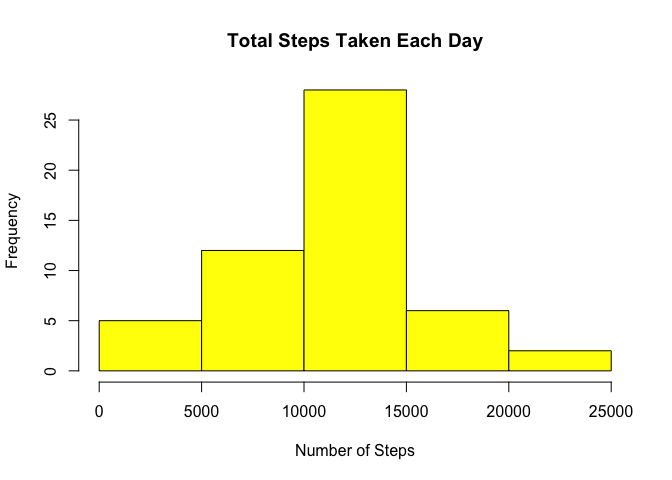
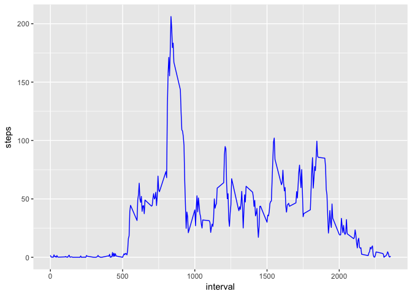
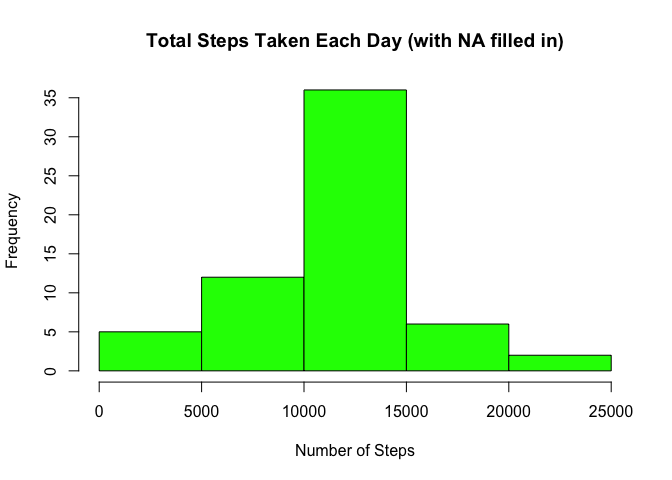

#Introduction

This assignment makes use of data from a personal activity monitoring device. This device collects data at 5 minute intervals through out the day. The data consists of two months of data from an anonymous individual collected during the months of October and November, 2012 and include the number of steps taken in 5 minute intervals each day.

#Preparation

This document can be processed by knitr and be transformed into an HTML file. echo = TRUE is applied to all the code chunks so that everyone will be able to read the code.


```r
library(knitr)
opts_chunk$set(echo = TRUE)
```

#Load libraries

Load all the libraries which will be used in the code chunks.


```r
library(ggplot2)
library(lattice)
```

#Load and preprocessing the data

1. Load the data


```r
setwd("~/Data/course5week2/RepData_PeerAssessment1")
activity  <- read.csv("activity.csv", sep = ",", header = T)
```

2. Process/transform the data (if necessary) into a format suitable for your analysis


```r
activity$date <- as.Date(as.character(activity$date), format = "%Y-%m-%d")
```

#What is mean total number of steps taken per day?

1. Make a histogram of the total number of steps taken each day


```r
totalstep <- aggregate(steps~date, data = activity, FUN = sum)
hist(totalstep$steps, main = "Total Steps Taken Each Day", xlab = "Number of Steps", col = "yellow")
```

<!-- -->

2. Calculate and report the mean and median total number of steps taken per day


```r
meanstep <- mean(totalstep$steps)
medianstep <- median(totalstep$steps)
print(meanstep)
```

```
## [1] 10766.19
```

```r
print(medianstep)
```

```
## [1] 10765
```

#What is the average daily activity pattern?

1. Make a time series plot of the 5-minute interval (x-axis) and the average number of steps taken, averaged across all days (y-axis)


```r
dailypattern <- aggregate(steps~interval, activity, FUN = mean)
ggplot(dailypattern, aes(x=interval, y=steps)) + geom_line(col = "blue")
```

<!-- -->

2. Which 5-minute interval, on average across all the days in the dataset, contains the maximum number of steps?


```r
max <- dailypattern[which.max(dailypattern$steps), 1]
print(max)
```

```
## [1] 835
```

#Imputing missing values

1. Calculate and report the total number of missing values in the dataset


```r
sum(is.na(activity$steps))
```

```
## [1] 2304
```

2. Fill in all of the missing values in the dataset with the mean for that 5-minute interval.


```r
for (i in 1:nrow(activity)) 
{if (is.na(activity[i,1])) 
        activity[i,1] <- dailypattern[activity[i,3]==dailypattern$interval, ]$steps
}
```

3. Create a new dataset that is equal to the original dataset but with the missing data filled in.


```r
fillactivity <- activity
```

4. Make a histogram of the total number of steps taken each day and Calculate and report the mean and median total number of steps taken per day. Do these values differ from the estimates from the first part of the assignment? What is the impact of imputing missing data on the estimates of the total daily number of steps?


```r
totalstep1 <- aggregate(steps~date, data = fillactivity, FUN = sum)
hist(totalstep1$steps, main = "Total Steps Taken Each Day (with NA filled in)", xlab = "Number of Steps", col = "green")
```

<!-- -->

Print mean and median steps


```r
meanstep1 <- mean(totalstep1$steps)
medianstep1 <- median(totalstep1$steps)
print(medianstep1)
```

```
## [1] 10766.19
```

```r
print(meanstep1)
```

```
## [1] 10766.19
```
The value is same as before.

#Are there differences in activity patterns between weekdays and weekends?

1. Create a new factor variable in the dataset with two levels -- "weekday" and "weekend" indicating whether a given date is a weekday or weekend day.


```r
fillactivity$w <- weekdays(fillactivity$date)
for (i in 1:nrow(fillactivity)) 
        {if (fillactivity$w[i] == "Saturday"|fillactivity$w[i] == "Sunday")
                fillactivity$day[i] <- "weekend"
        else fillactivity$day[i] <- "weekday"
}
```

2.Make a panel plot containing a time series plot of the 5-minute interval (x-axis) and the average number of steps taken, averaged across all weekday days or weekend days (y-axis).


```r
weekday <- aggregate(steps~interval + day, data = fillactivity, FUN = mean)
xyplot(steps~interval|day, data=weekday, type="l", xlab = "Interval", ylab= "Number of steps")
```

<!-- -->
